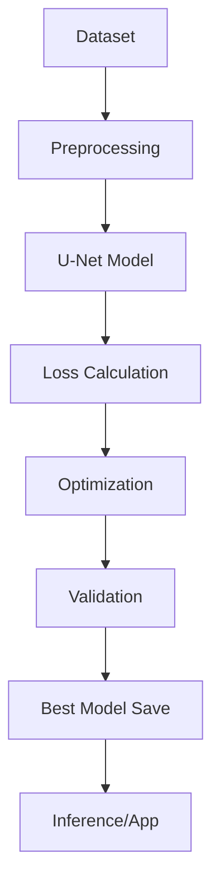

# U-Net Background Removal System

[](https://www.python.org/downloads/)
[](https://pytorch.org/)
[](https://opensource.org/licenses/MIT)

Un sistema avanzado de **eliminación de fondos** usando redes U-Net con soporte para múltiples datasets y aplicación web interactiva.

## Características Principales

- **Arquitectura U-Net Avanzada**: ResNet-50/34 como backbone con Attention Gates
- **3 Datasets Soportados**: COCO, AISegment Matting Human, Supervisely Persons
- **Configuración YAML**: Sistema flexible de configs para experimentos
- **Descarga Automática**: AISegment se descarga automáticamente con kagglehub
- **Muestreo Inteligente**: Entrenar con subsets (10%, 1000 imgs, etc.)
- **Aplicación Web**: Interfaz Streamlit para uso inmediato
- **Multi-GPU**: Entrenamiento distribuido con DDP
- **Métricas Completas**: IoU, Dice, Pixel Accuracy y análisis de calidad

## Inicio Rápido

### 1. Configuración del Entorno

```bash
# Clonar repositorio
git clone <tu-repositorio>
cd unet-background-removal

# Crear entorno virtual
python -m venv venv
source venv/bin/activate  # Linux/Mac
# o
venv\Scripts\activate     # Windows

# Instalar dependencias
pip install -r requirements.txt
```

### 2. Preparar Dataset

#### Opción A: AISegment Matting Human (Recomendado - Descarga Automática)
```bash
# Configurar API de Kaggle (requerido solo una vez)
mkdir -p ~/.kaggle
# Copiar tu kaggle.json desde https://www.kaggle.com/settings
# Ver docs/AISegment_Setup.md para instrucciones detalladas

# El dataset se descarga automáticamente al entrenar
python main.py train --config aisegment_quick
```

#### Opción B: Dataset COCO
```bash
# Crear directorio y descargar
mkdir -p datasets/COCO && cd datasets/COCO

# Descargar anotaciones y imágenes
wget http://images.cocodataset.org/annotations/annotations_trainval2017.zip
wget http://images.cocodataset.org/zips/train2017.zip
wget http://images.cocodataset.org/zips/val2017.zip

# Descomprimir
unzip annotations_trainval2017.zip
unzip train2017.zip
unzip val2017.zip

cd ../..
```

#### Opción C: Dataset Supervisely Persons (Legacy)
```bash
# Estructura esperada:
persons/
├── project/
│   ├── ds1/
│   │   ├── img/
│   │   └── ann/
│   └── ds2/
│       ├── img/
│       └── ann/
```

### 3. Verificar Sistema

```bash
# Verificación completa del sistema (recomendada primera vez)
python verify_setup.py

# Verificaciones específicas desde main.py
python main.py verify
python main.py status
python main.py config
```

### 4. Entrenar Modelo

```bash
# Con configuración por defecto (COCO)
python main.py train

# Prueba rápida con AISegment (1,000 imágenes)
python main.py train --config aisegment_quick

# Prueba rápida con COCO ResNet-34 (1,000 imágenes)
python main.py train --config resnet34_quick

# Entrenamiento completo AISegment (34,425 imágenes)
python main.py train --config aisegment_full

# Entrenamiento completo COCO ResNet-50
python main.py train --config resnet50_full

# Debugging (mínimo - 100 imágenes)
python main.py train --config debug

# Con config personalizado
python main.py train --config-path mi_experimento.yaml
```

### 5. Usar Aplicación Web

```bash
# Instalar dependencias adicionales
pip install -r requirements-app.txt

# Ejecutar aplicación
streamlit run app.py
```

## Comandos Disponibles

| Comando | Descripción | Tiempo Estimado |
|---------|-------------|-----------------|
| `python verify_setup.py` | **Verificación completa** del sistema | 2-3 minutos |
| `python main.py train` | Entrenamiento con config default | 2-4 horas |
| `python main.py train --config aisegment_quick` | Prueba rápida AISegment (1K imgs) | 15-30 minutos |
| `python main.py train --config resnet34_quick` | Prueba rápida COCO (1K imgs) | 15-30 minutos |
| `python main.py train --config debug` | Test mínimo (100 imgs) | 5-10 minutos |
| `python main.py harmonization` | Entrenar armonización | 1-2 horas |
| `python main.py verify` | Verificación específica | 1-2 minutos |
| `python main.py status` | Estado de módulos | 30 segundos |
| `python main.py config` | Mostrar configuraciones | 10 segundos |
| `streamlit run app.py` | Aplicación web interactiva | Inmediato |

## Configuración del Sistema

### Configuración via YAML (configs/*.yaml)

```yaml
# Ejemplo: configs/mi_experimento.yaml
experiment:
  name: "mi-experimento"
  description: "Entrenamiento personalizado"

model:
  architecture: "resnet50"  # o "resnet34"

dataset:
  type: "aisegment"  # o "coco" o "supervisely"
  root: "datasets/AISegment"
  sampling:
    enabled: true
    mode: "percentage"  # o "subset" o "full"
    percentage: 0.1  # 10% del dataset
    strategy: "random"  # o "first" o "balanced"

training:
  batch_size: 16           # Ajustar según GPU (8 para ≤6GB VRAM)
  learning_rate: 1e-4      # Learning rate conservador
  num_epochs: 50           # Épocas de entrenamiento
  image_size: 384          # Resolución de procesamiento
  num_workers: 8           # Procesos paralelos
  mixed_precision: true    # Usar AMP
```

### Optimización por Hardware

```yaml
# GPU con poca memoria (≤6GB VRAM)
training:
  batch_size: 8
  image_size: 256
  num_workers: 4
  gradient_accumulation_steps: 2

# GPU potente (≥12GB VRAM)
training:
  batch_size: 32
  image_size: 512
  num_workers: 12
  mixed_precision: true

# Solo CPU (no recomendado)
training:
  batch_size: 4
  image_size: 256
  num_workers: 2
  mixed_precision: false
```

### Configs Pre-configurados Disponibles

| Config | Dataset | Imágenes | Arquitectura | Uso |
|--------|---------|----------|--------------|-----|
| `default.yaml` | COCO | Todas | ResNet-50 | Entrenamiento estándar |
| `resnet50_full.yaml` | COCO | Todas | ResNet-50 | Producción |
| `resnet34_quick.yaml` | COCO | 1,000 | ResNet-34 | Test rápido |
| `resnet50_10percent.yaml` | COCO | 10% | ResNet-50 | Experimentación |
| `aisegment_full.yaml` | AISegment | 34,425 | ResNet-50 | Mejor calidad |
| `aisegment_10percent.yaml` | AISegment | ~3,400 | ResNet-50 | Experimentación |
| `aisegment_quick.yaml` | AISegment | 1,000 | ResNet-50 | Test rápido |
| `debug.yaml` | COCO | 100 | ResNet-50 | Debugging |

## Sistema de Configuración YAML

El proyecto utiliza un sistema flexible de configuración basado en archivos YAML que permite:

- **Experimentación rápida** sin modificar código
- **Versionado de experimentos** (configs en git)
- **Muestreo de datos** para pruebas rápidas
- **Múltiples datasets** (COCO, AISegment, Supervisely)
- **Selección de arquitectura** (ResNet-50 o ResNet-34)

### Crear Config Personalizado

```bash
# Copiar template
cp configs/aisegment_full.yaml configs/mi_experimento.yaml

# Editar según necesidades
nano configs/mi_experimento.yaml

# Ejecutar
python main.py train --config mi_experimento
```

### Estructura de Config YAML

```yaml
experiment:
  name: "nombre-del-experimento"
  description: "Descripción breve"

model:
  architecture: "resnet50"  # o "resnet34"

dataset:
  type: "aisegment"  # o "coco" o "supervisely"
  root: "datasets/AISegment"
  auto_download: true
  kaggle_dataset_id: "laurentmih/aisegmentcom-matting-human-datasets"

  # Muestreo de datos
  sampling:
    enabled: true
    mode: "percentage"  # "full", "subset", o "percentage"
    percentage: 0.1     # Para mode: percentage
    subset_size: 1000   # Para mode: subset
    strategy: "random"  # "random", "first", o "balanced"

training:
  batch_size: 16
  learning_rate: 1e-4
  num_epochs: 50
  image_size: 384
  num_workers: 8
  mixed_precision: true
  gradient_clip_max_norm: 0.5
```

### Modos de Muestreo

| Modo | Parámetro | Descripción | Ejemplo |
|------|-----------|-------------|---------|
| `full` | - | Todo el dataset | 34,425 imágenes (AISegment) |
| `subset` | `subset_size` | Cantidad fija | 1,000 imágenes |
| `percentage` | `percentage` | Porcentaje del total | 0.1 = 10% (~3,400 imgs) |

**Estrategias de selección:**
- `random`: Selección aleatoria (reproducible con seed)
- `first`: Primeras N imágenes
- `balanced`: Balanceado por categorías (si aplica)

### Ejemplos de Uso

```bash
# Prueba rápida con 1000 imágenes
python main.py train --config aisegment_quick

# 10% del dataset para experimentación
python main.py train --config aisegment_10percent

# Dataset completo para producción
python main.py train --config aisegment_full

# Config personalizado
python main.py train --config-path ~/mis_configs/experimento.yaml
```

## Arquitectura del Sistema

### Componentes Principales

```
unet-background-removal/
├── main.py                 # Punto de entrada principal
├── app.py                  # Aplicación web Streamlit
├── models/                 # Arquitecturas de redes
│   ├── unet.py            # Modelo U-Net base
│   └── advanced_unet.py   # Variantes avanzadas
├── datasets/               # Cargadores de datos
│   ├── coco_dataset.py    # Dataset COCO
│   └── supervisely.py     # Dataset Supervisely
├── training/               # Lógica de entrenamiento
├── inference.py            # Sistema de inferencia
├── utils.py               # Utilidades y verificaciones
├── settings.py            # Configuraciones globales
└── checkpoints/           # Modelos entrenados
```

### Flujo de Datos



## Usando la Aplicación Web

### Funcionalidades

- **Carga de Imágenes**: Drag & drop o selección manual
- **Configuración**: Ajuste de tamaño de procesamiento
- **Modo Debug**: Visualización paso a paso del proceso
- **Análisis de Calidad**: Métricas automáticas del resultado
- **Descarga**: Resultado en PNG con transparencia
- **Estadísticas**: Cobertura, contraste y definición

### Métricas de Calidad

La aplicación proporciona análisis automático:

- **Cobertura de Persona**: % del área detectada
- **Contraste de Máscara**: Definición de los bordes
- **Calidad de Segmentación**: Score global (0-100)
- **Recomendaciones**: Consejos para mejorar resultados

## Solución de Problemas

### Errores Comunes

#### "Dataset no encontrado"
```bash
# Verificar estructura
python main.py quick

# Para COCO:
ls COCO/annotations/person_keypoints_train2017.json
ls COCO/train2017/ | wc -l

# Para Supervisely:
ls persons/project/ds1/img/ | wc -l
```

#### "CUDA out of memory"
```python
# Reducir batch_size en main.py
config['batch_size'] = 8  # o 4

# Reducir tamaño de imagen
config['image_size'] = 256
```

#### "Modelo no converge"
```python
# Ajustar learning rate
config['learning_rate'] = 5e-5

# Aumentar épocas
config['num_epochs'] = 200

# Verificar datos
python main.py analyze
```

#### "Aplicación web lenta"
```bash
# Verificar modelo existe
ls checkpoints/best_model.pth

# Optimizar configuración CPU
# En app.py, ajustar tamaño de procesamiento
processing_size = 256  # En lugar de 384
```

### Monitoreo del Entrenamiento

```bash
# Usar screen para sesiones largas
screen -S training
python main.py train
# Ctrl+A, D para detach

# Reconectar más tarde
screen -r training

# Ver progreso en logs
tail -f logs/training_*.log

# Monitorear GPU
watch -n 2 nvidia-smi
```

## Rendimiento y Benchmarks

### Métricas Objetivo

| Métrica | Valor Objetivo | Valor Típico |
|---------|----------------|--------------|
| **IoU** | ≥0.85 | 0.82-0.88 |
| **Dice Score** | ≥0.90 | 0.87-0.92 |
| **Pixel Accuracy** | ≥0.95 | 0.93-0.97 |
| **Inference Time** | <100ms | 50-80ms |

### Rendimiento por Hardware

| Hardware | Tiempo/Imagen | Batch Size | Memoria |
|----------|---------------|------------|---------|
| **RTX 4090** | ~20ms | 32 | 12GB |
| **RTX 3080** | ~35ms | 24 | 10GB |
| **GTX 1080** | ~80ms | 16 | 8GB |
| **CPU (i7)** | ~2000ms | 4 | 8GB |

## Deployment y Producción

### Docker

```dockerfile
FROM python:3.9-slim

WORKDIR /app
COPY requirements.txt .
RUN pip install --no-cache-dir -r requirements.txt

COPY . .
EXPOSE 8501

CMD ["streamlit", "run", "app.py", "--server.address=0.0.0.0"]
```

```bash
# Construir y ejecutar
docker build -t bg-removal .
docker run -p 8501:8501 bg-removal
```

### API REST

```python
# Crear API con FastAPI (ver examples.py)
from fastapi import FastAPI, File, UploadFile

app = FastAPI()

@app.post("/remove_background")
async def remove_background(file: UploadFile = File(...)):
    # Procesar imagen y devolver resultado
    pass
```

### Optimización para Producción

```python
# Optimizar modelo para inferencia
import torch

# Exportar a TorchScript
model = torch.jit.script(trained_model)
model.save("optimized_model.pt")

# O exportar a ONNX
torch.onnx.export(model, dummy_input, "model.onnx")
```

## Recursos y Referencias

### Documentación Adicional

- **[README.COCO.md](README.COCO.md)**: Guía específica para dataset COCO
- **[README-app.md](README-app.md)**: Documentación de la aplicación web
- **[Docs/Utils.md](Docs/Utils.md)**: Herramientas y utilidades avanzadas

### Papers de Referencia

- [U-Net: Convolutional Networks for Biomedical Image Segmentation](https://arxiv.org/abs/1505.04597)
- [Attention U-Net: Learning Where to Look](https://arxiv.org/abs/1804.03999)
- [COCO: Common Objects in Context](https://arxiv.org/abs/1405.0312)

### Datasets

- **COCO Dataset**: [cocodataset.org](https://cocodataset.org/)
- **Supervisely Persons**: [app.supervisely.com](https://app.supervisely.com/)

## Contribuciones y Desarrollo

### Autores

**Luis Huacho y Dominick Alvarez**  
Maestría en Informática - PUCP  

### Estructura del Proyecto

El proyecto está diseñado con arquitectura modular:

- **Separación de responsabilidades**: Cada módulo tiene un propósito específico
- **Configuración centralizada**: Todas las configuraciones en `settings.py`
- **Extensibilidad**: Fácil agregar nuevos datasets y modelos
- **Testing**: Verificaciones automáticas integradas
- **Documentación**: README específico para cada componente

### Contribuir

1. Fork el repositorio
2. Crear rama feature (`git checkout -b feature/nueva-funcionalidad`)
3. Commit cambios (`git commit -am 'Agregar nueva funcionalidad'`)
4. Push a la rama (`git push origin feature/nueva-funcionalidad`)
5. Crear Pull Request

## Licencia

Este proyecto está bajo la **Licencia MIT** para fines académicos y de investigación.

---

## TL;DR - Guía Ultra Rápida

### Opción 1: AISegment (Más Fácil - Descarga Automática)
```bash
# 1. Setup
git clone <repo> && cd computer-vision-trabajo-grupal
python -m venv venv && source venv/bin/activate
pip install -r requirements.txt

# 2. Configurar Kaggle API (una sola vez)
mkdir -p ~/.kaggle
# Descargar kaggle.json desde https://www.kaggle.com/settings
# Copiar a ~/.kaggle/kaggle.json

# 3. Verificar y entrenar (descarga automática de dataset)
python verify_setup.py
python main.py train --config aisegment_quick

# 4. Usar app web
streamlit run app.py
```

### Opción 2: COCO (Tradicional)
```bash
# 1. Setup
git clone <repo> && cd computer-vision-trabajo-grupal
python -m venv venv && source venv/bin/activate
pip install -r requirements.txt

# 2. Dataset COCO
mkdir -p datasets/COCO && cd datasets/COCO
wget http://images.cocodataset.org/annotations/annotations_trainval2017.zip
wget http://images.cocodataset.org/zips/train2017.zip
unzip *.zip && cd ../..

# 3. Verificar y entrenar
python verify_setup.py
python main.py train --config resnet34_quick

# 4. Usar app web
streamlit run app.py
```

**¿Problemas?** → `python verify_setup.py` para verificación completa

**¿Primera vez?** → Consulta [CLAUDE.md](CLAUDE.md) para guía detallada

**¿AISegment setup?** → Ver [docs/AISegment_Setup.md](docs/AISegment_Setup.md)

**¿Configs YAML?** → Ver [configs/README.md](configs/README.md)

**¿Producción?** → Ver sección Deployment o consultar [README-app.md](README-app.md)
