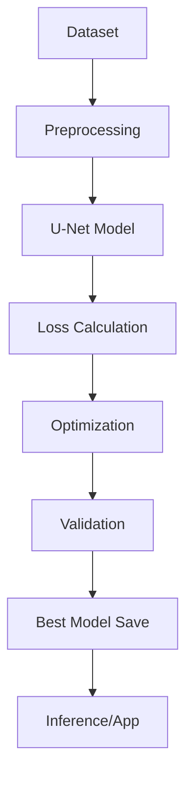

# 🎯 U-Net Background Removal System

[](https://www.python.org/downloads/)
[](https://pytorch.org/)
[](https://opensource.org/licenses/MIT)

Un sistema avanzado de **eliminación de fondos** usando redes U-Net con soporte para múltiples datasets y aplicación web interactiva.

## 🌟 Características Principales

- **🧠 Arquitectura U-Net Avanzada**: Segmentación precisa de personas
- **📊 Múltiples Datasets**: Soporte para COCO, Supervisely Persons y datasets personalizados
- **🌐 Aplicación Web**: Interfaz Streamlit para uso inmediato
- **⚡ GPU Optimizado**: Entrenamiento e inferencia acelerados
- **📈 Métricas Completas**: IoU, Dice, Pixel Accuracy y análisis de calidad
- **🔄 Sistema Modular**: Fácil extensión y personalización
- **📱 Deployment Ready**: Listo para producción con Docker y API

## 🚀 Inicio Rápido

### 1. Configuración del Entorno

```bash
# Clonar repositorio
git clone <tu-repositorio>
cd unet-background-removal

# Crear entorno virtual
python -m venv venv
source venv/bin/activate  # Linux/Mac
# o
venv\Scripts\activate     # Windows

# Instalar dependencias
pip install -r requirements.txt
```

### 2. Preparar Dataset

#### Opción A: Dataset COCO (Recomendado)
```bash
# Crear directorio y descargar
mkdir COCO && cd COCO

# Descargar anotaciones y imágenes
wget http://images.cocodataset.org/annotations/annotations_trainval2017.zip
wget http://images.cocodataset.org/zips/train2017.zip
wget http://images.cocodataset.org/zips/val2017.zip

# Descomprimir
unzip annotations_trainval2017.zip
unzip train2017.zip  
unzip val2017.zip

cd ..
```

#### Opción B: Dataset Supervisely Persons
```bash
# Estructura esperada:
persons/
├── project/
│   ├── ds1/
│   │   ├── img/
│   │   └── ann/
│   └── ds2/
│       ├── img/
│       └── ann/
```

### 3. Verificar Sistema

```bash
# Verificación completa (recomendada primera vez)
python main.py verify

# Verificación rápida de estructura
python main.py quick

# Análisis del dataset
python main.py analyze
```

### 4. Entrenar Modelo

```bash
# Entrenamiento automático con verificación
python main.py

# O entrenamiento directo
python main.py train
```

### 5. Usar Aplicación Web

```bash
# Instalar dependencias adicionales
pip install -r requirements-app.txt

# Ejecutar aplicación
streamlit run app.py
```

## 📋 Comandos Disponibles

| Comando | Descripción | Tiempo Estimado |
|---------|-------------|-----------------|
| `python main.py` | **Modo automático** - Verificación + entrenamiento | 2-4 horas |
| `python main.py verify` | Verificación completa del sistema | 2-3 minutos |
| `python main.py quick` | Verificación rápida de estructura | 30 segundos |
| `python main.py analyze` | Análisis estadístico del dataset | 1-2 minutos |
| `python main.py train` | Entrenamiento directo | 2-4 horas |
| `python main.py demo` | Demo de inferencia | 1 minuto |
| `streamlit run app.py` | Aplicación web interactiva | Inmediato |

## ⚙️ Configuración del Sistema

### Configuración de Entrenamiento (main.py)

```python
config = {
    'batch_size': 16,           # Ajustar según GPU (8 para ≤6GB VRAM)
    'learning_rate': 1e-4,      # Learning rate conservador
    'num_epochs': 100,          # Épocas de entrenamiento
    'image_size': 384,          # Resolución de procesamiento
    'weight_decay': 1e-6,       # Regularización
    'num_workers': 8,           # Procesos paralelos
    'device': 'auto',           # auto, cuda, cpu
}
```

### Optimización por Hardware

```python
# GPU con poca memoria (≤6GB VRAM)
config.update({
    'batch_size': 8,
    'image_size': 256,
    'num_workers': 4
})

# GPU potente (≥12GB VRAM)
config.update({
    'batch_size': 32,
    'image_size': 512,
    'num_workers': 12
})

# Solo CPU (no recomendado)
config.update({
    'batch_size': 4,
    'image_size': 256,
    'device': 'cpu'
})
```

## 📊 Arquitectura del Sistema

### Componentes Principales

```
unet-background-removal/
├── main.py                 # Punto de entrada principal
├── app.py                  # Aplicación web Streamlit
├── models/                 # Arquitecturas de redes
│   ├── unet.py            # Modelo U-Net base
│   └── advanced_unet.py   # Variantes avanzadas
├── datasets/               # Cargadores de datos
│   ├── coco_dataset.py    # Dataset COCO
│   └── supervisely.py     # Dataset Supervisely
├── training/               # Lógica de entrenamiento
├── inference.py            # Sistema de inferencia
├── utils.py               # Utilidades y verificaciones
├── settings.py            # Configuraciones globales
└── checkpoints/           # Modelos entrenados
```

### Flujo de Datos



## 🎯 Usando la Aplicación Web

### Funcionalidades

- **📤 Carga de Imágenes**: Drag & drop o selección manual
- **⚙️ Configuración**: Ajuste de tamaño de procesamiento
- **👁️ Modo Debug**: Visualización paso a paso del proceso
- **📊 Análisis de Calidad**: Métricas automáticas del resultado
- **💾 Descarga**: Resultado en PNG con transparencia
- **📈 Estadísticas**: Cobertura, contraste y definición

### Métricas de Calidad

La aplicación proporciona análisis automático:

- **Cobertura de Persona**: % del área detectada
- **Contraste de Máscara**: Definición de los bordes
- **Calidad de Segmentación**: Score global (0-100)
- **Recomendaciones**: Consejos para mejorar resultados

## 🔧 Solución de Problemas

### Errores Comunes

#### "Dataset no encontrado"
```bash
# Verificar estructura
python main.py quick

# Para COCO:
ls COCO/annotations/person_keypoints_train2017.json
ls COCO/train2017/ | wc -l

# Para Supervisely:
ls persons/project/ds1/img/ | wc -l
```

#### "CUDA out of memory"
```python
# Reducir batch_size en main.py
config['batch_size'] = 8  # o 4

# Reducir tamaño de imagen
config['image_size'] = 256
```

#### "Modelo no converge"
```python
# Ajustar learning rate
config['learning_rate'] = 5e-5

# Aumentar épocas
config['num_epochs'] = 200

# Verificar datos
python main.py analyze
```

#### "Aplicación web lenta"
```bash
# Verificar modelo existe
ls checkpoints/best_model.pth

# Optimizar configuración CPU
# En app.py, ajustar tamaño de procesamiento
processing_size = 256  # En lugar de 384
```

### Monitoreo del Entrenamiento

```bash
# Usar screen para sesiones largas
screen -S training
python main.py train
# Ctrl+A, D para detach

# Reconectar más tarde
screen -r training

# Ver progreso en logs
tail -f logs/training_*.log

# Monitorear GPU
watch -n 2 nvidia-smi
```

## 📈 Rendimiento y Benchmarks

### Métricas Objetivo

| Métrica | Valor Objetivo | Valor Típico |
|---------|----------------|--------------|
| **IoU** | ≥0.85 | 0.82-0.88 |
| **Dice Score** | ≥0.90 | 0.87-0.92 |
| **Pixel Accuracy** | ≥0.95 | 0.93-0.97 |
| **Inference Time** | <100ms | 50-80ms |

### Rendimiento por Hardware

| Hardware | Tiempo/Imagen | Batch Size | Memoria |
|----------|---------------|------------|---------|
| **RTX 4090** | ~20ms | 32 | 12GB |
| **RTX 3080** | ~35ms | 24 | 10GB |
| **GTX 1080** | ~80ms | 16 | 8GB |
| **CPU (i7)** | ~2000ms | 4 | 8GB |

## 🌐 Deployment y Producción

### Docker

```dockerfile
FROM python:3.9-slim

WORKDIR /app
COPY requirements.txt .
RUN pip install --no-cache-dir -r requirements.txt

COPY . .
EXPOSE 8501

CMD ["streamlit", "run", "app.py", "--server.address=0.0.0.0"]
```

```bash
# Construir y ejecutar
docker build -t bg-removal .
docker run -p 8501:8501 bg-removal
```

### API REST

```python
# Crear API con FastAPI (ver examples.py)
from fastapi import FastAPI, File, UploadFile

app = FastAPI()

@app.post("/remove_background")
async def remove_background(file: UploadFile = File(...)):
    # Procesar imagen y devolver resultado
    pass
```

### Optimización para Producción

```python
# Optimizar modelo para inferencia
import torch

# Exportar a TorchScript
model = torch.jit.script(trained_model)
model.save("optimized_model.pt")

# O exportar a ONNX
torch.onnx.export(model, dummy_input, "model.onnx")
```

## 📚 Recursos y Referencias

### Documentación Adicional

- 📖 **[README.COCO.md](README.COCO.md)**: Guía específica para dataset COCO
- 🎭 **[README-app.md](README-app.md)**: Documentación de la aplicación web
- 🔧 **[Docs/Utils.md](Docs/Utils.md)**: Herramientas y utilidades avanzadas

### Papers de Referencia

- [U-Net: Convolutional Networks for Biomedical Image Segmentation](https://arxiv.org/abs/1505.04597)
- [Attention U-Net: Learning Where to Look](https://arxiv.org/abs/1804.03999)
- [COCO: Common Objects in Context](https://arxiv.org/abs/1405.0312)

### Datasets

- 🏷️ **COCO Dataset**: [cocodataset.org](https://cocodataset.org/)
- 👥 **Supervisely Persons**: [app.supervisely.com](https://app.supervisely.com/)

## 🤝 Contribuciones y Desarrollo

### Autores

**Luis Huacho y Dominick Alvarez**  
Maestría en Informática - PUCP  

### Estructura del Proyecto

El proyecto está diseñado con arquitectura modular:

- **Separación de responsabilidades**: Cada módulo tiene un propósito específico
- **Configuración centralizada**: Todas las configuraciones en `settings.py`
- **Extensibilidad**: Fácil agregar nuevos datasets y modelos
- **Testing**: Verificaciones automáticas integradas
- **Documentación**: README específico para cada componente

### Contribuir

1. Fork el repositorio
2. Crear rama feature (`git checkout -b feature/nueva-funcionalidad`)
3. Commit cambios (`git commit -am 'Agregar nueva funcionalidad'`)
4. Push a la rama (`git push origin feature/nueva-funcionalidad`)
5. Crear Pull Request

## 📄 Licencia

Este proyecto está bajo la **Licencia MIT** para fines académicos y de investigación.

---

## 🏁 TL;DR - Guía Ultra Rápida

```bash
# 1. Setup
git clone <repo> && cd unet-background-removal
python -m venv venv && source venv/bin/activate
pip install -r requirements.txt

# 2. Dataset (COCO recomendado)
mkdir COCO && cd COCO
wget http://images.cocodataset.org/annotations/annotations_trainval2017.zip
wget http://images.cocodataset.org/zips/train2017.zip
unzip *.zip && cd ..

# 3. Verificar y entrenar
python main.py verify
python main.py train

# 4. Usar app web
pip install -r requirements-app.txt
streamlit run app.py
```

**¿Problemas?** → `python main.py quick` para verificación rápida

**¿Primera vez?** → Consulta [README.COCO.md](README.COCO.md) para guía detallada

**¿Producción?** → Ver sección Deployment o consultar [README-app.md](README-app.md)
